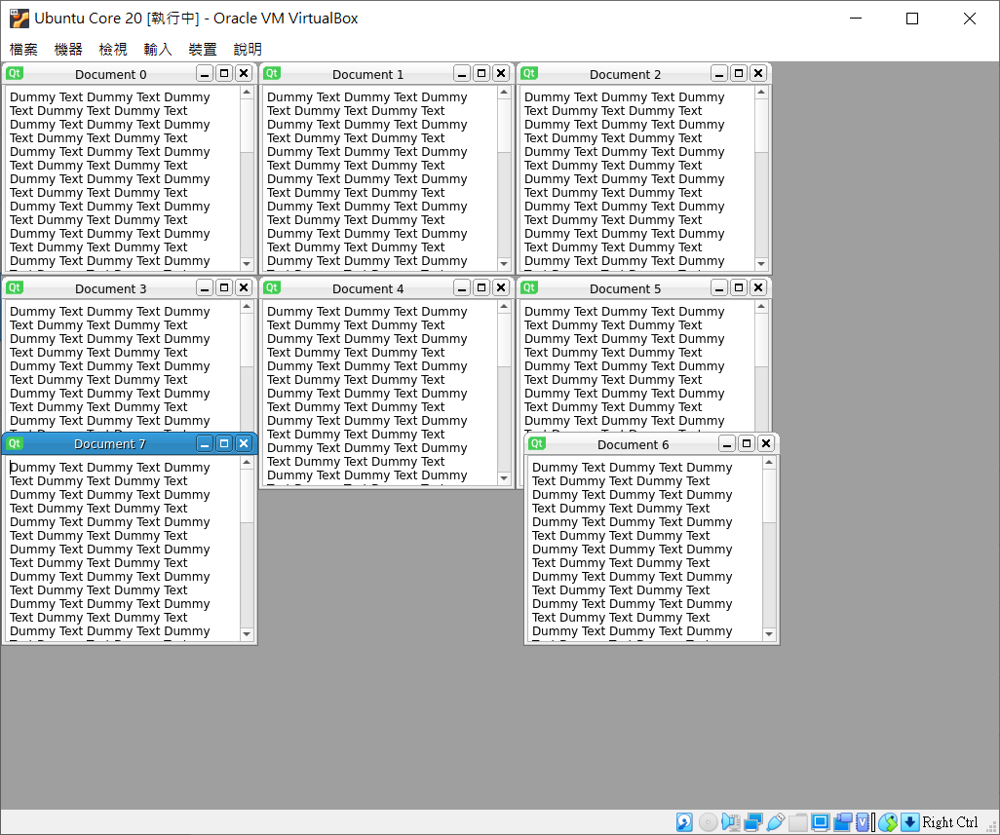

# PySide2 example on Mir-kiosk

## Build

1. install snapcraft:
    ```sh
    $ sudo snap install snapcraft --classic
    ```
2. download this repo:
    ```sh
    $ git clone https://github.com/kyumdbot/mir-kiosk-pyside2-example.git
    $ cd mir-kiosk-pyside2-example
    ```
3. building the snap:
    ```sh
    $ snapcraft --use-lxd
    ```

## Install example app to Ubuntu Core 20

1. login to your Ubuntu Core device, and install mir-kiosk:
    ```sh
    $ snap install mir-kiosk
    ```
2. copy mir-kiosk-pyside2-example_0.1_amd64.snap to your Ubuntu Core device.
3. install mir-kiosk-pyside2-example_0.1_amd64.snap:
    ```sh
    $ snap install --dangerous ./mir-kiosk-pyside2-example_0.1_amd64.snap
    ```

## Screenshot
 


 
